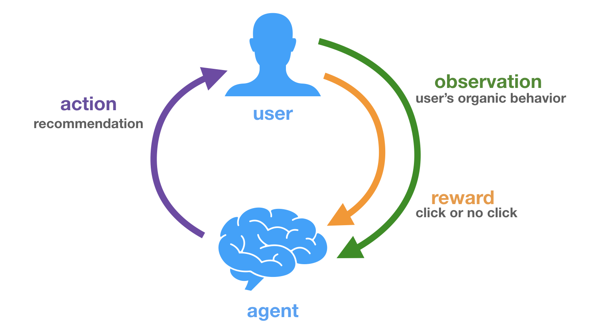

# Gym-Aerotroponice

Gym-Aerotroponice is a Gym environment for testing recommendation algorithms for Aerotroponice application.

## Actions
- Activities
- Products (Restaurants, Hotels …)

## Observations
- User’s position
- Tastes
- History of activities done
- History on the application (pages seen …)

## Rewards
- Positive reward if the user click on the recommended activity / product
- No reward if he doesn’t click on it

